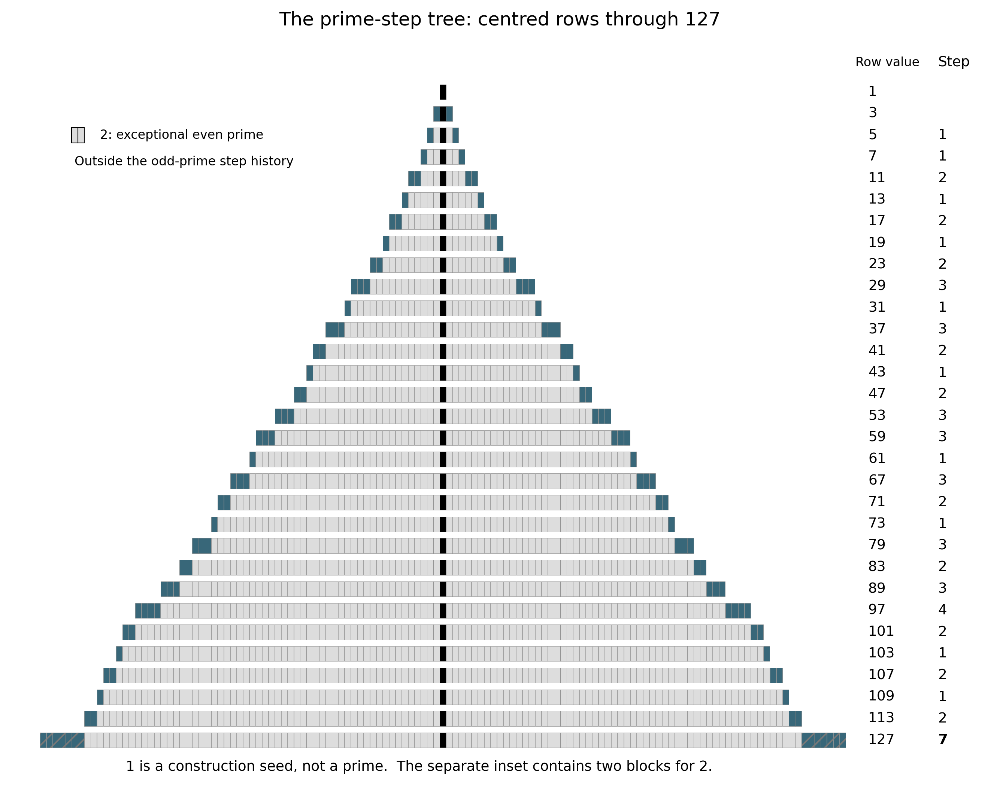
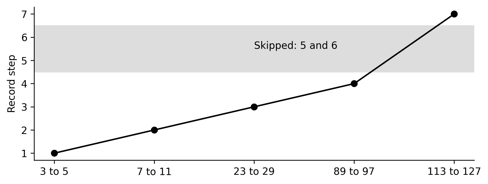
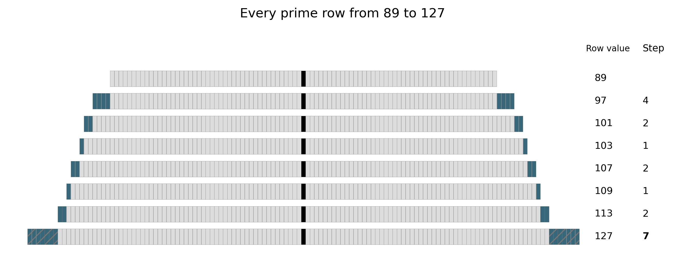
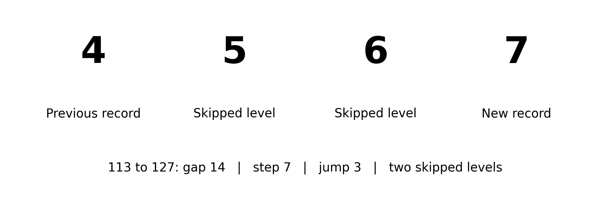
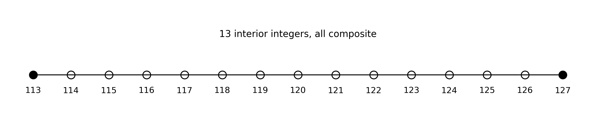
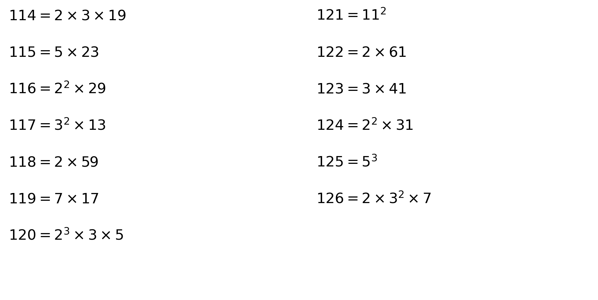
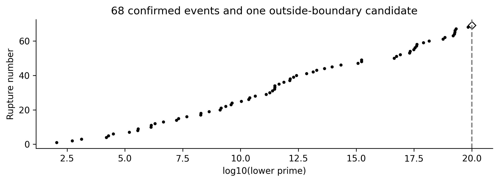
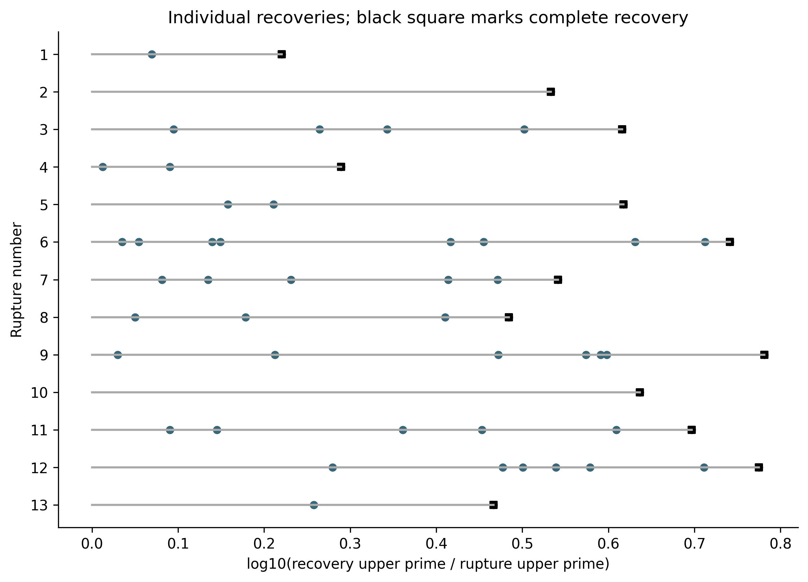
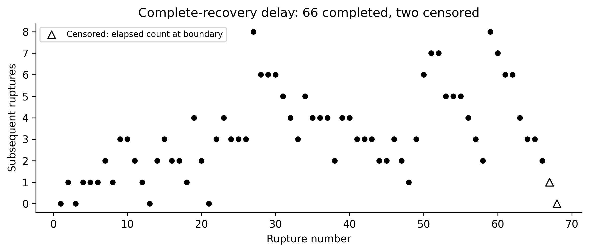
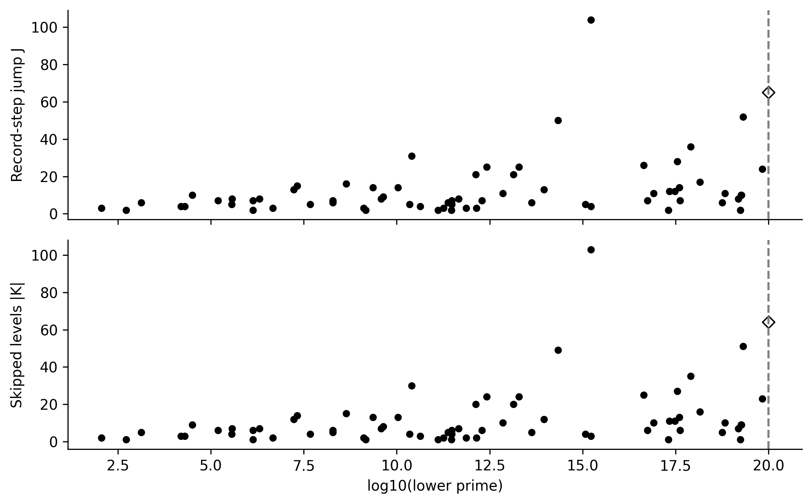

# Prime-Gap Ruptures: Skipped Levels in the Record Growth of Consecutive Prime Gaps

Riccardo Panza

Independent researcher | 14 September 2026

## 1 Abstract

For consecutive odd primes, write s=(q−p)/2 and let M be the largest earlier step. We define a prime-gap rupture by s>M+1: a record expansion that skips at least one intermediate integer half-gap level. Every rupture is necessarily a record prime gap. The first occurs at 113→127, where the previous record step 4 increases to 7 and skips levels 5 and 6. An independent segmented sieve through 100,000,000 reproduces the original thirteen events and extends direct verification to sixteen. Published exhaustive-search data through 10²⁰ support a catalogue of 68 ruptures, of which the first 66 have completely observed recovery. Every skipped level in those 66 events appears within that boundary. The maximum observed complete-recovery delay is eight subsequent ruptures. The remaining two events have right-censored recovery; a 69th listed candidate lies beyond the detection boundary. Universal recovery remains unproved and no predictive mechanism is claimed. The contribution is definitional, visual and computational: a record-transition classification, a centred prime-step tree and reproducible skipped-level recovery statistics. A rupture interior is also described as a prime desert and, through its composite factorisations, a prime-factor oasis; unusual factor richness is not established.

## 2 Introduction

Record prime gaps describe the successive largest separations between consecutive primes. This paper distinguishes records whose half-gap increases by one from records that bypass intermediate half-gap levels. The latter are called prime-gap ruptures. The bypassed values provide a finite set whose first later appearances can be recorded and compared.

The underlying prime gaps are established mathematical data. The proposed contribution is a classification of record-gap transitions according to whether intermediate half-gap levels are skipped, together with a visual representation and a recovery analysis of those skipped levels. Its potential utility lies in organising observations and formulating testable questions; a predictive application is not required or demonstrated.

Existing computational catalogues already record maximal gaps and first occurrences [1–4]. Half-gap first-occurrence order is explicitly represented by OEIS A014321, while differences between successive record gaps are OEIS A053695 [5–6]. Thus neither dividing gaps by two nor measuring record increments is new. The framework combines these objects with a centred block display and event-specific recovery sets. The combined terminology, visualisation and recovery framework appears distinctive within the literature examined; this is a limited literature assessment, not an absolute novelty claim.

## 3 Origin of the prime-step representation

The starting point is Panza's exploratory paper, originally titled “Violation Events in the Prime Sequence”, and its associated factor spreadsheet. The working term “violation event” is replaced by “prime-gap rupture” because no mathematical rule is broken. The original numerical catalogue survives the audit, while interpretations involving capacity or structural responses do not follow from its definition.

For each odd prime p, place p equal blocks in a centred row: one spine block and (p−1)/2 blocks on each side. A row containing 1 is a construction seed, not a prime; 2 is displayed separately as the exceptional even prime. The word tree refers to the shape of this display, not to a graph-theoretic branching rule. All odd-prime rows through 127 are shown in Figure 1.

## 4 Prime gaps and traversal steps

Let p₁=2,p₂=3,… be the increasing sequence of primes. For n≥2 define gₙ=pₙ₊₁−pₙ and sₙ=gₙ/2. Both endpoints are odd, so sₙ is a positive integer. The exceptional gap 2→3 has size 1 and is excluded from the step history. Initialise that history with 3→5, step 1. For n≥3 put Mₙ=max{ sⱼ : 2≤j<n }.

A transition adds sₙ blocks to each side of the tree. Equivalently, it takes sₙ moves of length 2 to travel between the endpoints on the odd-number lattice. There are sₙ−1 odd integers strictly inside the gap, and 2sₙ−1 interior integers altogether. Steps are an exact rescaling of gaps: gₙ=2sₙ. The display changes presentation, not arithmetic information.

Table 1. Short glossary.

| Term | Meaning |
|---|---|
| Prime gap | gₙ=pₙ₊₁−pₙ. |
| Step | sₙ=gₙ/2 for consecutive odd primes. |
| Prime-step tree | Centred block representation of odd primes, with seed 1. |
| Record step | A step larger than every earlier step. |
| Record expansion | A transition establishing a new record step. |
| Sequential record expansion | Record increase of exactly one step level. |
| Prime-gap rupture | Record increase of more than one step level. |
| Rupture jump | Jₙ=sₙ−Mₙ. |
| Skipped step | An intermediate level bypassed by a rupture. |
| Skipped-step set | Kₙ={Mₙ+1,…,sₙ−1}. |
| Recovery | First later occurrence of a skipped step. |
| Complete recovery | First upper endpoint by which every skipped step has appeared. |
| Recovery delay | A stated index, numerical, logarithmic or event-count distance. |
| Right-censored recovery | Not observed through the complete recovery-data boundary. |
| Rupture desert | The prime-free integer interior of a rupture interval. |
| Prime-factor oasis | Descriptive view of composite factor structure in that interior. |
| Computational boundary | Largest declared point of complete relevant data. |

## 5 Record expansions

A record expansion satisfies sₙ>Mₙ. A sequential record expansion satisfies sₙ=Mₙ+1. The initial step 1 is the seed record; it is not compared with an undefined earlier maximum. Record growth is different from the sequence of all steps, which can rise and fall.

Table 2. Early record steps.

| Pair | Gap | Step | Classification |
|---|---|---|---|
| 3→5 | 2 | 1 | Initial record |
| 7→11 | 4 | 2 | Sequential |
| 23→29 | 6 | 3 | Sequential |
| 89→97 | 8 | 4 | Sequential |
| 113→127 | 14 | 7 | Rupture |

## 6 Definition of a prime-gap rupture

A prime-gap rupture is a transition satisfying sₙ>Mₙ+1. Its jump is Jₙ=sₙ−Mₙ, its skipped-step set is Kₙ={Mₙ+1,…,sₙ−1}, and its skipped-level count is |Kₙ|=Jₙ−1. Thus a rupture occurs precisely when Jₙ≥2. Every skipped value exceeds the earlier maximum and has therefore never occurred previously. Skipped sets from different ruptures are disjoint, since record values strictly increase.

Proposition. Every prime-gap rupture is necessarily a record prime gap.

Proof. If sₙ>Mₙ+1, then sₙ>Mₙ. Hence sₙ exceeds every earlier odd-prime step, and gₙ=2sₙ exceeds every earlier odd-prime gap. It also exceeds the exceptional initial gap 1. Therefore it is a record prime gap. Conversely, a record with Jₙ=1 is sequential and is not a rupture. ∎

The equivalent criterion in gap units is gₙ>Gprevious+2. A non-record gap cannot qualify, even if some smaller gap sizes remain unrealised. This corrects the contrary statements in Sections 4.1 and 10.1 of the original paper. “Rupture” denotes a numerical discontinuity in sequential record growth, without implying a physical event or causal mechanism.

## 7 The first rupture: 113→127

The early records are steps 1,2,3,4,7. The three increases to 2,3,4 are sequential. At 113→127 the record jumps directly from 4 to 7, bypassing 5 and 6. Independent prime enumeration verifies that no earlier transition satisfies the rupture condition.

Table 3. First-rupture calculation.

| Quantity | Value |
|---|---|
| Pair | 113→127 |
| Gap | 127−113=14 |
| Step | 14/2=7 |
| Earlier maximum | 4 |
| Condition | 7>4+1 |
| Jump | 7−4=3 |
| Skipped set | {5,6} |
| Skipped count | 3−1=2 |

The tree makes the final expansion conspicuous, but its visual prominence supplies no evidence of a deeper mechanism. The numerical definition establishes the event.

## 8 Rupture deserts and prime-factor oases

Every consecutive-prime interval is prime-free in its interior. A rupture desert is specifically the integer interior of a prime-gap rupture. Under this definition, (113,127) is the first rupture desert, consisting of the thirteen composite integers 114,…,126. It is not the first prime-free interval.

Viewed additively, this interval is a prime desert. Viewed multiplicatively, its factorisations offer a complementary prime-factor oasis. “A prime-gap rupture creates a prime desert at the surface and reveals a prime-factor oasis beneath it” is a descriptive bridge; “creates” here denotes association with an interval, not a causal process.

The oasis description does not imply that rupture interiors contain statistically more factors than comparable ordinary prime gaps. All composite intervals admit factorisation. Whether rupture interiors have unusual factor structure after controlling for gap length and numerical location belongs to Paper Two. The source spreadsheet's missing 19 at 114 and missing 31 at 124 are corrected in this illustration; its full cell audit is supplied separately.

## 9 Skipped steps and recovery

For each skipped step t in Kₙ, let F(t) be the lower endpoint of the first consecutive-prime gap of size 2t, if such a gap exists. Its recovery pair is F(t)→F(t)+2t. This occurrence must be later than the rupture, because t exceeded every earlier step. Complete recovery is observed at the upper endpoint of the last such pair. We also report that pair's lower endpoint as complete_p. No recovery date is assigned until both endpoints lie within the observation boundary.

For 113→127, step 5 first appears at 139→149 and step 6 at 199→211. The recovery order is 5,6 and complete recovery is observed at 211, before any subsequent rupture. “Recovery” means first later occurrence only, not repair or balancing.

For a rupture at gap index n and recovery at j, gap-count distance and prime-index distance both equal j−n: the immediately next gap has distance 1. Numerical distance uses lower endpoints F(t)−pₙ. The ratio is F(t)/pₙ and logarithmic distance is its natural logarithm. Record and rupture delays count later events completed by the recovery upper endpoint, excluding the originating rupture. Those counters can be zero despite positive numerical delay. Index fields are left blank beyond the direct sieve rather than estimated.

Missing recoveries within a complete observation range are right-censored. A censored event is retained, with its observed partial recovery order. An event beyond the rupture-detection boundary is a different case: even its place in the global record sequence is not established here.

## 10 Data and computational methods

The reproducible pipeline uses exact Python integers. A segmented sieve of Eratosthenes enumerates all primes through 10⁸ using blocks of 1,000,000 integers. It finds 5,761,455 primes, ending at 99,999,989, and sixteen ruptures. The original thirteen lie within 5,000,000; their complete recoveries require a larger range, ending at 13,626,407.

Table 4. Detection and recovery boundaries. Both endpoints must be within each bound.

| Purpose | Boundary | Coverage |
|---|---|---|
| Original rupture detection | 5,000,000 | 13 events; independently reproduced |
| Direct detection and recovery | 100,000,000 | 16 events; full local prime enumeration |
| Published detection and recovery | 10²⁰ | 68 events; source-reported exhaustive coverage |
| Candidate 69 | Above 10²⁰ | Local pair verification only |

The expanded catalogue uses a frozen Prime Gap List Project snapshot [1]. Its reported exhaustive boundary is 10²⁰, attained on 8 May 2026 [2]. OEIS lower and upper record endpoints agree for all 85 listed entries [3]. First-occurrence lower endpoints agree with OEIS A000230 for steps 1–721, and chronological half-gap order agrees for all 747 terms available in A014321 [4–5]. These publications share underlying discoveries, so agreement is a publication cross-check rather than two independent exhaustive searches. All first occurrences inside the direct sieve also match the independently generated data.

Every listed record pair and every accepted skipped-step recovery pair is locally checked for consecutive primality. A bounded deterministic Miller–Rabin test uses the first thirteen prime bases, through 41, below 3,317,044,064,679,887,385,961,981, using the threshold of Sorenson and Webster [7]. Both endpoints pass and every interior integer is composite. These local tests establish consecutiveness, not global record priority or first-occurrence priority; the latter depend on exhaustive source computations above 10⁸.

The final numerical run used Python 3.12.14 on Linux-6.18.44-x86_64-with-glibc2.39 (x86_64). It took 4.18 seconds, with approximately 13.4 MiB peak resident memory. This is a single-process CPU computation, excluding downloads, spreadsheet extraction, figures and document rendering. No specialised hardware or GPU is required; wall time varies by machine.

CSV endpoint fields are decimal integer strings and must be imported as text into spreadsheet software to avoid its fifteen-digit precision limit. Ratios and logarithms alone use floating-point arithmetic; they never determine ordering or status. Source snapshots, hashes, code, tests and a non-programmer run guide accompany the paper. No exhaustive computation to 10²⁰ was rerun locally.

## 11 Verified rupture catalogue

Table 5. Original thirteen events, independently reproduced. M is the earlier maximum.

| No. | Lower p | Upper q | s | M | Skipped levels |
|---|---|---|---|---|---|
| 1 | 113 | 127 | 7 | 4 | 5–6 |
| 2 | 523 | 541 | 9 | 7 | 8 |
| 3 | 1327 | 1361 | 17 | 11 | 12–16 |
| 4 | 15683 | 15727 | 22 | 18 | 19–21 |
| 5 | 19609 | 19661 | 26 | 22 | 23–25 |
| 6 | 31397 | 31469 | 36 | 26 | 27–35 |
| 7 | 155921 | 156007 | 43 | 36 | 37–42 |
| 8 | 360653 | 360749 | 48 | 43 | 44–47 |
| 9 | 370261 | 370373 | 56 | 48 | 49–55 |
| 10 | 1349533 | 1349651 | 59 | 57 | 58 |
| 11 | 1357201 | 1357333 | 66 | 59 | 60–65 |
| 12 | 2010733 | 2010881 | 74 | 66 | 67–73 |
| 13 | 4652353 | 4652507 | 77 | 74 | 75–76 |

The first thirteen rows reproduce the original table exactly in their endpoint, step and previous-record fields. The expanded list contains 69 qualifying transitions among the first 85 listed record gaps, where that record numbering includes 2→3. However, only 84 record entries and 68 ruptures fall inside 10²⁰. Among the 82 odd-prime record transitions after initialisation, 68 are ruptures (82.9%) and 14 are sequential. This proportion describes that finite record catalogue, not all prime gaps.

Candidate 69 is 101,412,319,996,363,309,069→101,412,319,996,363,310,923. Its gap is 1854 and its step is 927. Relative to the listed previous record 862, it has jump 65 and skipped set {863,…,926}, comprising 64 levels. The endpoints and their consecutiveness are locally verified. Although the source list flags this entry as maximal and first-occurring, the separate exhaustive-coverage statement stops at 10²⁰. We therefore retain it provisionally outside the confirmed catalogue; intervening undiscovered records could change its classification or numbering. The appendix preserves all 69 entries with this distinction.

## 12 Recovery observations

Table 6. Complete recovery of the first thirteen events. Delay counts subsequent ruptures.

| No. | Last recovery pair | Last step | Delay |
|---|---|---|---|
| 1 | 199→211 | 6 | 0 |
| 2 | 1831→1847 | 8 | 1 |
| 3 | 5591→5623 | 16 | 0 |
| 4 | 30593→30631 | 19 | 1 |
| 5 | 81463→81509 | 23 | 1 |
| 6 | 173359→173429 | 35 | 1 |
| 7 | 542603→542683 | 40 | 2 |
| 8 | 1100977→1101071 | 47 | 1 |
| 9 | 2238823→2238931 | 54 | 3 |
| 10 | 5845193→5845309 | 58 | 3 |
| 11 | 6752623→6752747 | 62 | 2 |
| 12 | 11981443→11981587 | 72 | 1 |
| 13 | 13626257→13626407 | 75 | 0 |

All skipped levels of the first thirteen events recover within the direct sieve. Their maximum delay is three subsequent ruptures, attained by events 9 and 10. That finite maximum does not survive expansion: among the 66 completely recovered events within 10²⁰, the maximum is eight, attained by events 27 and 59. The requested first-59 checkpoint is confirmed and extended to the first 66; events 60–66 should not be labelled censored.

Table 7. Recovery and censoring status at 10²⁰.

| Events | Recovered levels | Unresolved | Status |
|---|---|---|---|
| 1–59 | All | 0 | Complete |
| 60–66 | All | 0 | Complete |
| 67 | 22 of 51 | 29 | Right-censored |
| 68 | 1 of 23 | 22 | Right-censored |
| 69 | Not assessed | Not applicable | Outside detection boundary |

The 68 confirmed events skip 779 distinct levels. Of these, 728 recover within the boundary and 51 remain unresolved. Events 1–66 account for 705 skipped levels, all recovered; event 67 has 22 of 51 recovered and event 68 has 1 of 23. Completed-event delays have median 3 and mean 3.30 subsequent ruptures. Counts for delays 0 through 8 are respectively 4,8,12,16,10,5,6,3,2. These completed-case summaries exclude censored events and should not be interpreted as unbiased estimates of eventual delay.

The prime sequence is deterministic. Counts, proportions, quantiles and plots here summarise a specified finite catalogue. No sampling population, independent observations, p-values or confidence intervals are assumed. Comparisons with explicitly defined random models would concern model behaviour, not randomness asserted of the primes.

## 13 Potential utility for future research

The classification may help organise maximal-gap catalogues into sequential and skipped-level expansions. Joining these records to first-occurrence tables supplies reproducible recovery orders, completion points and several distance measures. A larger study could compare how these statistics change across numerical scales while preserving the observation boundary and incomplete cases.

Probabilistic models offer a separate comparative setting. Cramér-type models and their refinements do not automatically describe every feature of actual prime gaps; Granville discusses important limitations [8], and Banks, Ford and Tao develop a model incorporating sieving [9]. Kourbatov studies maximal-gap distributions in Cramér's model, and Kourbatov and Wolf examine record-gap trends [10–11]. Applying the same rupture and recovery definitions to specified models may reveal useful agreements or discrepancies. No such model experiment is claimed in this paper.

Paper Two could test factorisation patterns, prime powers, parity, sieve depth, factor covers, midpoint symmetry and primorial relationships in rupture interiors, against matched gaps of similar length and location. The oasis hypothesis could prove to be merely a memorable description of compositeness; that negative result would still clarify the framework. Alphabetic factor language, predictive modelling, twin-prime centres and composite-index grids remain outside Paper One. The tree also offers an accessible teaching representation of record growth and the difference between computation and proof.

## 14 Limitations

The global large-number results rely on published exhaustive searches rather than a new exhaustive sieve. The source database flags and its stated coverage differ for candidate 69; this paper adopts the conservative boundary. First-occurrence endpoint cross-checks against a second publication cover steps through 721, not every later recovery. Shared provenance limits independence. Local primality verification cannot resolve unseen earlier occurrences. Prime-index distances are available only inside the direct sieve.

The literature search is focused rather than exhaustive. Existing half-gap and record-difference sequences limit novelty claims. The main tree is a chosen representation and the oasis is descriptive. No matched-control factor-richness result, universal recovery theorem, universal delay bound, fractal structure or predictive mechanism is established. The original odd-composite comparison does not establish prime-specificity.

Negative and inconclusive findings are substantive: the maximum delay rises from three to eight on extension; the final confirmed events remain unresolved; candidate 69 lacks coverage at the adopted boundary; and proposed structural or causal interpretations are unsupported. The original numerical observation remains useful without those interpretations.

## 15 Open questions

1. How do recovery order and complete-recovery delay change as exhaustive coverage grows, with the same censoring and event-count conventions?
2. Which explicitly specified prime-gap models reproduce the joint behaviour of rupture frequency, jump size and recovery delay?
3. After accounting for numerical scale and skipped-set size, what descriptive variation remains in the last recovered level and completion distance?
4. Do matched ordinary gaps explain all apparent factor structure in rupture interiors, or does any robust difference remain?
5. Can the centred tree measurably improve understanding of record gaps and finite computational evidence in a teaching study?

Polignac's conjecture asserts infinitely many consecutive-prime gaps of each positive even size. It would imply recovery of every skipped level. Recovery needs only a first occurrence of each skipped size and is not proved by existing bounded-gap results [5,12]. No new conjecture is advanced here.

## 16 Conclusion

Prime-gap ruptures distinguish sequential record-gap growth from record jumps that bypass intermediate half-gap levels. The first event, 113→127, and its recovery are exact and readily visualised. The declared exhaustive boundary supports 68 ruptures and complete recovery for 66; two remain censored and one further listed candidate is retained separately. Skipped sets and their recovery provide reproducible objects for future computational study. Their potential utility is sufficient to motivate this observational framework without a claim of prediction or a universal law.

Table 8. Classification of conclusions.

| Class | Conclusion |
|---|---|
| Proved statements | Every rupture is a record; skipped count equals jump minus one; skipped sets are disjoint. |
| Verified data | Local sieve and pair checks; published-priority catalogue through 10²⁰. |
| Finite observations | 66 complete recoveries; observed maximum delay eight. |
| Descriptive interpretations | Prime-step tree, rupture desert and prime-factor oasis. |
| Potential utility | Classification, cataloguing, model comparison and teaching. |
| Conjectures | No new conjecture proposed; universal recovery is unproved. |
| Unresolved questions | 51 skipped levels censored; candidate 69 priority; factor-richness. |

## Declaration of generative AI and AI-assisted technologies

During preparation of this work, the author used OpenAI Codex in ChatGPT Work (GPT-5, accessed 13–14 September 2026), under his direction, to assist with manuscript restructuring, mathematical and computational auditing, Python code development and testing, literature discovery, tabulation and figure generation. The originating concept, prime-step representation, source manuscript, spreadsheet and research direction were supplied by the author. All numerical claims used in the paper were checked using the documented code and cited source data; the computational record is released for independent inspection. The author reviewed and approved the manuscript and accepts responsibility for its claims and interpretation. The AI system is not an author.

## 17 References

[1] Prime Gap List Project. Prime Gap Records, allgaps.sql snapshot and data-field documentation. Accessed 13 September 2026. https://github.com/primegap-list-project/prime-gap-list ; https://primegap-list-project.github.io/prime-gap-record-data-fields/

[2] Prime Gap List Project. Exhaustively analyzed gaps. Accessed 13 September 2026; boundary rechecked 14 September 2026. https://primegap-list-project.github.io/fully-analyzed/

[3] OEIS Foundation. A002386, record-gap lower primes; A000101, upper primes; A005250, record-gap values. B-files accessed 13 September 2026. https://oeis.org/A002386 ; https://oeis.org/A000101 ; https://oeis.org/A005250

[4] OEIS Foundation. A000230, smallest lower prime for each even gap. B-file through step 721, refreshed 14 September 2026. https://oeis.org/A000230

[5] H. Mlcousek and OEIS contributors. A014321, first-occurrence half-gap order; B-file by Brian Kehrig, with earlier terms by Ferenc Adorjan. Accessed 13 September 2026. https://oeis.org/A014321

[6] J. Burch and OEIS contributors. A053695, differences between record prime gaps. Entry originated 23 March 2000. Accessed 13 September 2026. https://oeis.org/A053695

[7] J. P. Sorenson and J. Webster. Strong pseudoprimes to twelve prime bases. Mathematics of Computation 86 (2017), 985–1003. https://doi.org/10.1090/mcom/3134

[8] A. Granville. Harald Cramér and the distribution of prime numbers. Scandinavian Actuarial Journal 1995, 12–28. https://www.dms.umontreal.ca/~andrew/PDF/cramer.pdf

[9] W. Banks, K. Ford and T. Tao. Large prime gaps and probabilistic models. Inventiones Mathematicae 233 (2023), 1471–1518; corrected author version 2025. https://arxiv.org/abs/1908.08613

[10] A. Kourbatov. The distribution of maximal prime gaps in Cramér's probabilistic model of primes. International Journal of Statistics and Probability 3(2) (2014), 18–29. https://arxiv.org/abs/1401.6959

[11] A. Kourbatov and M. Wolf. Predicting maximal gaps in sets of primes. Mathematics 7(5) (2019), 400. https://arxiv.org/abs/1901.03785

[12] J. Maynard. Small gaps between primes. Annals of Mathematics 181 (2015), 383–413. https://arxiv.org/abs/1311.4600

[13] C. Caldwell. The Gaps Between Primes. PrimePages. Accessed 13 September 2026. Uses the alternative convention counting interior composites. https://t5k.org/notes/gaps.html

## 18 Computational appendix

The following complete catalogue includes confirmed events 1–68 and the clearly separated candidate 69. Upper endpoints are obtained exactly as q=p+g. The accompanying CSV gives both endpoints, skipped sets, status, completion points and recovery order. The separate recovery dataset has one row per skipped level, including censored and outside-boundary rows. A separate audit supplies all corrections to the original text and spreadsheet.

Table A1. Expanded catalogue. C=confirmed within 10²⁰; P=outside-boundary candidate.

| No. | Lower prime p | Gap | M | s | Skipped | Status |
|---|---|---|---|---|---|---|
| 1 | 113 | 14 | 4 | 7 | 5–6 | C |
| 2 | 523 | 18 | 7 | 9 | 8 | C |
| 3 | 1327 | 34 | 11 | 17 | 12–16 | C |
| 4 | 15683 | 44 | 18 | 22 | 19–21 | C |
| 5 | 19609 | 52 | 22 | 26 | 23–25 | C |
| 6 | 31397 | 72 | 26 | 36 | 27–35 | C |
| 7 | 155921 | 86 | 36 | 43 | 37–42 | C |
| 8 | 360653 | 96 | 43 | 48 | 44–47 | C |
| 9 | 370261 | 112 | 48 | 56 | 49–55 | C |
| 10 | 1349533 | 118 | 57 | 59 | 58 | C |
| 11 | 1357201 | 132 | 59 | 66 | 60–65 | C |
| 12 | 2010733 | 148 | 66 | 74 | 67–73 | C |
| 13 | 4652353 | 154 | 74 | 77 | 75–76 | C |
| 14 | 17051707 | 180 | 77 | 90 | 78–89 | C |
| 15 | 20831323 | 210 | 90 | 105 | 91–104 | C |
| 16 | 47326693 | 220 | 105 | 110 | 106–109 | C |
| 17 | 189695659 | 234 | 111 | 117 | 112–116 | C |
| 18 | 191912783 | 248 | 117 | 124 | 118–123 | C |
| 19 | 436273009 | 282 | 125 | 141 | 126–140 | C |
| 20 | 1294268491 | 288 | 141 | 144 | 142–143 | C |
| 21 | 1453168141 | 292 | 144 | 146 | 145 | C |
| 22 | 2300942549 | 320 | 146 | 160 | 147–159 | C |
| 23 | 3842610773 | 336 | 160 | 168 | 161–167 | C |
| 24 | 4302407359 | 354 | 168 | 177 | 169–176 | C |
| 25 | 10726904659 | 382 | 177 | 191 | 178–190 | C |
| 26 | 22367084959 | 394 | 192 | 197 | 193–196 | C |
| 27 | 25056082087 | 456 | 197 | 228 | 198–227 | C |
| 28 | 42652618343 | 464 | 228 | 232 | 229–231 | C |
| 29 | 127976334671 | 468 | 232 | 234 | 233 | C |
| 30 | 182226896239 | 474 | 234 | 237 | 235–236 | C |
| 31 | 241160624143 | 486 | 237 | 243 | 238–242 | C |
| 32 | 297501075799 | 490 | 243 | 245 | 244 | C |
| 33 | 303371455241 | 500 | 245 | 250 | 246–249 | C |
| 34 | 304599508537 | 514 | 250 | 257 | 251–256 | C |
| 35 | 461690510011 | 532 | 258 | 266 | 259–265 | C |
| 36 | 738832927927 | 540 | 267 | 270 | 268–269 | C |
| 37 | 1346294310749 | 582 | 270 | 291 | 271–290 | C |
| 38 | 1408695493609 | 588 | 291 | 294 | 292–293 | C |
| 39 | 1968188556461 | 602 | 294 | 301 | 295–300 | C |
| 40 | 2614941710599 | 652 | 301 | 326 | 302–325 | C |
| 41 | 7177162611713 | 674 | 326 | 337 | 327–336 | C |
| 42 | 13829048559701 | 716 | 337 | 358 | 338–357 | C |
| 43 | 19581334192423 | 766 | 358 | 383 | 359–382 | C |
| 44 | 42842283925351 | 778 | 383 | 389 | 384–388 | C |
| 45 | 90874329411493 | 804 | 389 | 402 | 390–401 | C |
| 46 | 218209405436543 | 906 | 403 | 453 | 404–452 | C |
| 47 | 1189459969825483 | 916 | 453 | 458 | 454–457 | C |
| 48 | 1686994940955803 | 924 | 458 | 462 | 459–461 | C |
| 49 | 1693182318746371 | 1132 | 462 | 566 | 463–565 | C |
| 50 | 43841547845541059 | 1184 | 566 | 592 | 567–591 | C |
| 51 | 55350776431903243 | 1198 | 592 | 599 | 593–598 | C |
| 52 | 80873624627234849 | 1220 | 599 | 610 | 600–609 | C |
| 53 | 203986478517455989 | 1224 | 610 | 612 | 611 | C |
| 54 | 218034721194214273 | 1248 | 612 | 624 | 613–623 | C |
| 55 | 305405826521087869 | 1272 | 624 | 636 | 625–635 | C |
| 56 | 352521223451364323 | 1328 | 636 | 664 | 637–663 | C |
| 57 | 401429925999153707 | 1356 | 664 | 678 | 665–677 | C |
| 58 | 418032645936712127 | 1370 | 678 | 685 | 679–684 | C |
| 59 | 804212830686677669 | 1442 | 685 | 721 | 686–720 | C |
| 60 | 1425172824437699411 | 1476 | 721 | 738 | 722–737 | C |
| 61 | 5733241593241196731 | 1488 | 738 | 744 | 739–743 | C |
| 62 | 6787988999657777797 | 1510 | 744 | 755 | 745–754 | C |
| 63 | 15570628755536096243 | 1526 | 755 | 763 | 756–762 | C |
| 64 | 17678654157568189057 | 1530 | 763 | 765 | 764 | C |
| 65 | 18361375334787046697 | 1550 | 765 | 775 | 766–774 | C |
| 66 | 18571673432051830099 | 1572 | 776 | 786 | 777–785 | C |
| 67 | 20733746510561442863 | 1676 | 786 | 838 | 787–837 | C |
| 68 | 68068810283234182907 | 1724 | 838 | 862 | 839–861 | C |
| 69 | 101412319996363309069 | 1854 | 862 | 927 | 863–926 | P |

Table A2. Sources and provenance. External snapshots accessed 13 September 2026; A000230 refreshed and the boundary rechecked on 14 September 2026.

| Source | Role | Limit |
|---|---|---|
| Original PDF and workbook | Origin and audit targets | Not assumed correct |
| Prime Gap List Project [1–2] | Record and first-occurrence source | Exhaustive priority adopted only through 10²⁰ |
| OEIS A002386/A000101 [3] | 85 record endpoint cross-checks | Shared underlying discoveries |
| OEIS A000230 [4] | First-occurrence endpoints | Steps 1–721 cross-checked |
| OEIS A014321 [5] | Half-gap chronological order | All 747 available terms cross-checked |
| Independent segmented sieve | Full enumeration through 10⁸ | Not extended to 10²⁰ |
| Bounded Miller–Rabin [7] | All listed record and accepted recovery pairs | Consecutiveness only |

The analysis stops on any mismatch between source records, local sieve, first-occurrence cross-checks or consecutiveness tests. The automated suite covers the exceptional initial gap, initialisation, records, sequential expansions, ruptures, skipped sets, recovery, censoring, the original thirteen rows and expanded checkpoints. Tests check implementation and finite data; they do not establish any universal recovery proposition.
